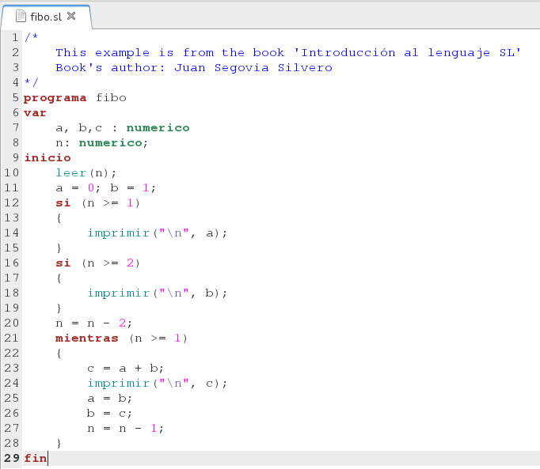

sl-highlight
============

sl-highlight is a simple language spec for GtkSourceView-based
editors, such as Gedit, in order to highlight the syntax of SL language.

#### Install ####

In order to install sl-highlight you need to do the following in your command line
    
    $ bash install.sh

Then open your editor (gedit, etc)
    
    $ gedit test/fibo.sl

and you should see something like this

